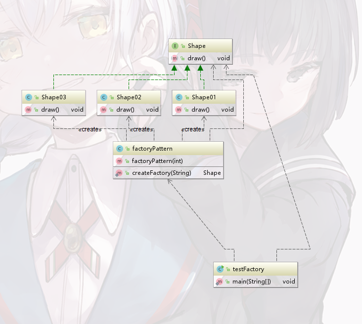
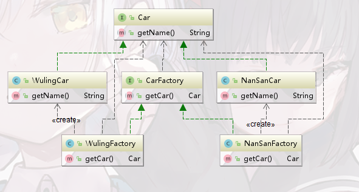
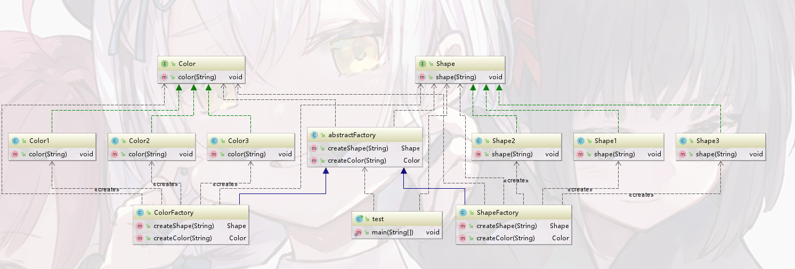

# 设计模式的目的

1）代码重用性：相同功能代码，不用多次编写

2）可读性：编程规范性，便于其他程序员阅读和理解

3）可扩展性：当需要增加新的功能时，分厂的方便

4）可靠性：当我们新增新的功能后，对原来的功能没有影响

# 七大原则核心思想

##### 1）单一职责原则：

​	一个类只负责一个职责，如果需要多个职责，就需要进行粒度拆分。进行类拆分或者方法拆分

##### 2）接口隔离原则：

​	一个类对另一个依赖应该建立在最小的接口上【注意是最小接口，如果接口过大就需要进行拆分】

##### 3）依赖倒转原则：

​	中心思想就是面向接口编程。对于一个具体方法最好不要直接依赖于实体类，而是依赖于一个接口或者抽象类

##### 4）里氏替换原则：

​	在使用继承时，遵循里氏替换原则，在子类中尽量不要重写父类的方法。因为继承会使得耦合性升高，可以使用组合、聚合或者依赖来解决

​	传递时三个方法：

​	1、接口传递：通过实体类的接口来进行依赖传递

​	2、构造方法传递：通过实体类的构造器进行参数传递

​	3、setter传递：差不多也是通过接口传递【通过接口的set抽象方法来进行，但是实体对象的引用归于实体类】

##### 5）开闭原则OCP：

​	当软件需要变化时，尽量通过扩展软件实体的行为来实现变化，而不是通过修改已有的代码来实现变化

##### 6）迪米特法则[也被称为最少知道原则]：

​	直接朋友：称出现成员变量、方法参数、方法返回值中的类为直接的朋友

​	陌生的类最好不要使用局部变量的形式出现在类的内部【不是直接朋友就是陌生的类】

##### 7）合成复用原则：

​	原则就是尽量使用**合成/聚合**方式来组织，而不是使用继承

# 设计模式主要被分为下面三大类

### 创建者模式

#### 	1、单例模式[五种实现方式]

##### 		1）懒汉式

​			1、资源利用效率高，到那时调用返回方法实例的方法都要同步，并发效率较低

```java
public class Single02 implements Serializable{
   private static transient Single02 single = null;
   
   private Single02() {
      if(single!=null){  //用于防止通过反射来创建多个对象
         throw new RuntimeException();
      }
   }
   
   public static synchronized Single02 getInstance() {
      if(single==null) {
         single = new Single02();
      }
      return single;
   }
```

##### 		2）饿汉式

​			1、直接加载，但是如果一直不使用，就会造成资源浪费

```java
public class Single01 implements Serializable{
   //创建Single一个对象，类初始化时，就会加载这个实例
   private static Single01 instance = new Single01();
   
   private static String str;
   
   private Single01() {}
   
   public static Single01 getSingle01() {
      return instance;
   }
}
```

##### 		3）双重检测锁模式

```java
//为什么变量一定需要volatile修饰
//1、因为它可以防止指令重排
public class Single03 {
   private volatile static Single03 single = null;
   
   private Single03() {}
   
   public static Single03 getInstance() {
      //一、
      if(single==null) {
         Single03 sc;
         synchronized(Single03.class){
            sc = single;
            if(sc==null) {
               synchronized(Single03.class){
                  if(sc==null) {
                     sc = new Single03();
                  }
               }
               single = sc;
            }
         }
      }
      return single;
   }
}
/*在上述中，new一个对象的操作并不是一个原子性的操作，它分为三个步骤【指令】
1、new 分配内存给对象【还会进行一些类字段的初始化】
2、dup 这个操作只是将对象复制一份，然后全部压入堆顶
3、invokespecial  进行类构造器的调用，进行对象字段的初始化
4、astore_?  将对象赋值给变量

在上述过程中，如果出现3和4的指令重排，有可能导致，对象还没有完全初始化，变量已经被赋值完成。
这就会导致有些进入到一、的直接就拿到了对象，在使用的时候就会出现错误
*/
```

##### 		4）枚举形式

​			1）没有延时加载的特性

​			2）可以天然的防止反射和反序列化漏洞

```java
public enum Single05 {
   INSTANCE;
   
   public static void get() {
      
   }
}
```

##### 		5）静态内部类模式

​		1、外部类没有static，并不会像饿汉式一样直接加载对象

​		2、当调用类的时候才会进行类字段的加载。【加载类时是线程安全的，这是JVM机制实现的】

```java
public class Single04 {
   private static class SingleInstance {
      private static final Single04 instance = new Single04();
   }
   
   public static Single04 getInstance() {
      return SingleInstance.instance;
   }
   private Single04() {}
}
```

##### 		6）但是上述的1~3和5还是有一些纰漏。

​		比如他们可以通过反射或者序列化来实现破解单例模式

​		防止方法：

```java
private 构造器() {
   if(single!=null){  //用于防止通过反射来创建多个对象
      throw new RuntimeException();
   }
}
//在构造器中判断该类是否已经被创建了

/**
* 这里使得反序列化时，也会返回这个已经构造的单例
* @return
* @throws ObjectStreamException
*/
private Object readResolve()throws ObjectStreamException{
	return instance;
}
//实现这个方法的类，需要实现Serializable接口
```

##### 	7）他们的基础UML图：

​	

#### 2、工厂模式[三种实现方式]

##### 1、我们为什么需要使用工厂模式

​	明明可以直接通过new或者反射来创建对象，但是为什么需要工厂模式？

​	如果我们通过反射或者new的方式来创建对象，那么其实是将对象的**创建和使用**过程进行了一个耦合，违反了单一原则。并且在修改业务代码的时候，可能会由于代码量过大，很难第一时间找到需要更改的点

​	而使用工厂模式，就会将对象的创建和对象的使用过程进行解耦。如果创建过程很复杂，可以减少代码冗余，并且也方便以后的扩展和维护。当以后业务扩展时，就只需要增加对应的工厂类就可以了

##### 		2、简单工厂模式：

```java
/*
*这就是简单工厂模式
	优点：实现简单
	缺点：但是如果需要新增类，就需要修改此处代码，违反了开闭原则
*/
public class factoryPattern {
   public factoryPattern(int id){}
   public static Shape createFactory(String message) throws Exception{
      Shape shape = null;
      if(message == null) {
         throw new Exception("空指针异常");
      }else if(message.equals("Shape01")) {
         shape = new Shape01();
      }else if(message.equals("Shape02")) {
         shape = new Shape02();
      }else if(message.equals("Shape03")) {
         shape = new Shape03();
      }
      return shape;
   }
}
```

​		简单工厂模式UML类图

​	

##### 		3、工厂模式：

​			1）优点：每一类对应一个工厂，这样在新增类时，就无需修改源代码

​			2）缺点：如果类过多，就会造成类爆炸

```java
/*
一个类对应一个工厂
*/
//NanSanCar类
public class NanSanCar implements Car {
    @Override
    public String getName() {
        System.out.println("南山");
        return "南山";
    }
}
//NanSanCar类对应的工厂
public class NanSanFactory implements CarFactory {
    @Override
    public Car getCar() {
        return new NanSanCar();
    }
}
//WulingCar类
public class WulingCar implements Car {
    @Override
    public String getName() {
        System.out.println("五菱");
        return "五菱";
    }
}
//WulingCar类对应的工厂
public class WulingFactory implements CarFactory {
    @Override
    public Car getCar() {
        return new WulingCar();
    }
}
/*讲解：https://www.zhihu.com/question/20367734*/
```

​		工厂模式对应UML类图：

​		

##### 		4、上述之间的区别：

​		简单工厂模式，**多个类对应一个工厂**。但是工厂模式**一个类对应一个工厂**

##### 		5、抽象工厂模式：

```xml
如何解决：在一个产品镞里面定义多个产品
关键代码：在一个工厂里面聚合多个同类的产品
```

```java
/**
 * 创建多个产品的接口
 */
public abstract class AbstractFactory {
   public abstract Shape createShape(String type);
   public abstract Color createColor(String type);
}
//获取一个对应的工厂
public class GetFactory {
	public static abstractFactory getFactory(String other) {
		if(other.equals("Shape")) {
			return new returnShape();
		}else if(other.equals("Color")) {
			return new returnColor();
		}
		return null;
	}
}
//实现对应的工厂
//颜色类对应的工厂
public class ColorFactory extends abstractFactory{

	@Override
	public Shape createShape(String type) {
		return null;
	}

	@Override
	public Color createColor(String type) {
		Color color = null;
		if(type==null) {
			return null;
		}else if(type.equals("Color1")) {
			color = new Color1();
		}else if(type.equals("Color2")) {
			color = new Color2();
		}else if(type.equals("Color3")) {
			color = new Color3();
		}
		return color;
	}
}
//形状类对应的工厂
public class ShapeFactory extends abstractFactory{

	@Override
	public Shape createShape(String type) {
		Shape shape = null;
		if(type==null) {
			return null;
		}else if(type.equals("Shape1")) {
			shape = new Shape1();
		}else if(type.equals("Shape2")) {
			shape = new Shape2();
		}else if(type.equals("Shape3")) {
			shape = new Shape3();
		}
		return shape;
	}

	@Override
	public Color createColor(String type) {
		return null;
	}
}
```

​	抽象工厂模式类图		

##### 	6、它们之间的区别：

​		1、工厂模式：解决的是**同类产品构造**的问题

​		2、抽象工厂模式：解决的是一个**产品族**的构造问题

#### 3、建造者模式

##### 	1）我们为什么需要一个建造者模式？

​		如果一个物体的组装需要很复杂的步骤，我们就需要使用建造者模式，来提高扩展性

##### 	2）作用：

​		将一个复杂对象的构建与它的表示分离，使得同样的构建过程可以创建不同的表示。

##### 	3）角色需求

​		1、需要一个建造的接口【Builder】

​		2、需要多个建造接口的实现类【ConcreteBuilder】

​		3、需要一个装配者的接口【Director】

​		4、需要一个装配者的实现类【ConcreteDirector】

​		5、需要被组装的实体类

​		注意：MyBatis的SqlSessionFactory的构建也是使用了建造者模式。但是它并没有装配的类，说明：有时为了简化程序，可以直接将Director进行省略

##### 	4）UML类图为：


​		1、Director【装配者】直接与用户沟通，判断用户想要那种类型的对象

​		2、沟通好之后，将用户创建产品的需求划分为各个部件的建造请求

​		3、委派到具体的建造者类

​		4、进行产品构建的构造

​		5、最终构建成一个产品【Entity实体类对象】

##### 	5）优点和缺点

​		**优点：**每一个构造者都是独立的，这样在增加构造者时，无需修改其他的代码，达到开闭原则

​		并且将构造过程与构造对象进行解耦，使得相同的构造过程可以构造不同的对象

​		**缺点：**需要产品的属性不能相差过大。并且每一个对象都需要构造一个具体的Builder对象

#### 4、原型模式

###### 	1、是什么

​	用原型实例制定创建对象的种类，并且通过**拷贝**这些原型来创建新的对象

###### 	2、实现方式

​	1）通过实现Cloneable接口来实现克隆，但是这种克隆，如果字段里里面如果具有其他对象的引用，必须也对这个对象进行再次克隆，否则得到的就是浅克隆，而非深克隆

```java
public class Sheap implements Cloneable {

    private String name;

    private String id;

    private Date date;

    @Override
    protected Object clone() throws CloneNotSupportedException {
        Object obj = super.clone();  //直接调用Object的clone
        Sheap sheap = (Sheap)obj;
        //需要再次对date字段进行克隆
        sheap.setDate((Date) sheap.getDate().clone());
        return obj;
    }
    
    /*省略setter和getter方法*/
    
    @Override
    public String toString() {
        return "Sheap{" +
                "name='" + name + '\'' +
                ", id='" + id + '\'' +
                '}';
    }
}
```

​	2）通过序列化实现深克隆

```java
public class Sheap implements Serializable {

    public static long serialVersionUID = 2222222222L;

    private String id;
    private String name;

    private Date date;
    /*省略setter、getter和toString方法*/
}
//执行
public static void main(String[] args) throws IOException, ClassNotFoundException {
        Sheap1 sheap1 = new Sheap1();
        sheap1.setDate(new Date(System.currentTimeMillis()));
        sheap1.setId("1");
        sheap1.setName("我是");
        System.out.println(sheap1+"-->"+sheap1.getDate());

        ByteArrayOutputStream byteArrayInputStream = new ByteArrayOutputStream();
        ObjectOutputStream objectOutputStream = new ObjectOutputStream(byteArrayInputStream);

        objectOutputStream.writeObject(sheap1);

        sheap1.setName("我不是");
        sheap1.serialVersionUID = 11111L;

        ObjectInputStream objectInputStream = new ObjectInputStream(new ByteArrayInputStream(byteArrayInputStream.toByteArray()));

        Sheap1 sheap11 = (Sheap1)objectInputStream.readObject();
        sheap11.setDate(new Date(System.currentTimeMillis()+1000));

        System.out.println(sheap11+"-->"+sheap11.getDate());
        System.out.println(sheap1+"-->"+sheap1.getDate());
}
```

###### 	3、为什么使用？

​	如果重新初始化一个对象过于耗费时间时，就可以使用原型模式直接克隆对象，会比重新创建一个对象**节省时间**。【Spring构建对象时使用的就是原型模式】

```java
<bean id="prototype" class="com.proto.MyProtoType" scope="prototype">
```

### 结构性模式

​	[核心作用，从程序的结构上实现松耦合，从而可以扩大整体的类结构，从而解决更大的问题]

#### 	1、适配器模式

##### 		1）角色以及角色的作用

​			Target：将我们其他的类转换成为我们期望的接口

​			Adapter：将被适配者和目标类组合在一起

​			Adaptee：需要被改变为我们期望的接口

​			UML类图：


##### 			2）作用：

​			让两个不兼容的接口一起工作。

​			例子：比如说电脑，每次接一个外部设备的时候，我们都需要安装驱动才可以使用【当然，你可以换一台电脑】，驱动就可以相当于Adapter，而我们接入的外部设备就是被适配类

##### 		3）解析一个SpringMvc的适配器模式：

```java
//DispatcherServlet中的doDispatch()
// Determine handler for the current request.
//获取处理器的执行器流【里面主要包含一个处理器和多个过滤器】
HandlerExecutionChain mappedHandler = getHandler(processedRequest);
if (mappedHandler == null || mappedHandler.getHandler() == null) {
   noHandlerFound(processedRequest, response);
   return;
}
// Determine handler adapter for the current request.
//获取一个处理器的适配器
HandlerAdapter ha = getHandlerAdapter(mappedHandler.getHandler());
//然后使用适配器进行执行最终类的方法
mv = ha.handle(processedRequest, response, mappedHandler.getHandler());

//请求-->DispatcherServlet【相当于Target接口】-->HandlerAdapter【即为Adapter】-->Handler【Adaptee】
//但是需要注意，此处的Adapter并不是实现了Target，而是Target将其使用List进行了组合，然后Adapter与Adaptee进行映射，最终中执行了Adaptee的方法
/**
问题：其实再mappedHandler.getHandler()方法时已经获取到了处理器类，为什么不直接执行？

因为，每一个处理器类的实现方法可能存在较大差异，如果直接执行，那么对于代码来说，需要很多的if..else语句来判断应该去执行哪一个处理器的方法，并且在增加处理器的时候，需要修改代码【违反开闭原则】。如果使用的时适配器去调用，我们在增加处理器时，只需要增加一个适配器即可，Spring容器会自动扫描，并注入。此时，我们并不需要修改DispatcherServlet里面的代码就可以直接运行
*/
```

##### 	4）场景：

​		如果系统功能需要对接第三方的组件时，就可以使用适配器模式

​		比如说支付系统【有支付宝支付、微信支付等等】

​		那么就可以先定义一个我们需要的接口，然后再为支付宝、微信来设置一个适配器，用于翻译它们

​		得到我们需要的接口

#### 	2、代理模式

##### 	1、角色以及类图

​	角色：

​	ProxyHandler：一个代理类

​	AbstractRole：被代理对象的接口【jdk的动态代理需要接口。但是使用CGLIB的就不需要】

​	TargetRole：真实的对象，实现抽象角色。关注真正的业务逻辑

​	Proxy：是动态代理时期生成的类，它具有真实对象的方法

​	InvocationHandler：实现JDK代理方式需要实现的接口

​	UML类图：

​	

##### 	2、应用场景：

​		安全代理：屏蔽对真实对象的直接访问

​		延迟加载：先加载轻量级的代理对象，真正需要时再加载真实对象

##### 	3、实现分类

###### 		1）静态代理

​		即我们自己实现的代理：
​		

```java
//代理类
public class staticProxyTest implements Star {

    private Star star;

    public staticProxyTest(Star star){
        this.star = star;
    }

    @Override
    public void getMoney() {
        System.out.println("你是");
        star.getMoney();
    }
}
//接口
public interface Star {

    void getMoney();

}
//实现类
public class StarImpl implements Star {
    @Override
    public void getMoney() {
        System.out.println("获取钱");
    }
}
```

###### 		2）动态代理

​		可以使用JDK自带的动态代理

​		javaassist字节码操作库实现

​		CGLIB【它是以构建子类方式实现的，所以要想代理成功，那么真实对象不能使用final修饰】

​		ASM

​		1、jdk自带的动态代理：

```java
//这里就是代理类，【接口和真实对象不再给出】
public class ProxyTest implements InvocationHandler {
	//真实对象
    private Object target;

    public Object getInstance(Object target){
        this.target = target;
        return 
//返回代理类        Proxy.newProxyInstance(target.getClass().getClassLoader(),target.getClass().getInterfaces(),this);
    }

    @Override
    public Object invoke(Object proxy, Method method, Object[] args) throws Throwable {
        System.out.println();

        System.out.println("还会");

        Object target = method.invoke(this.target,args);

        return target;
    }
}
```

​		2、CGLIB实现

```java
//这里就是代理类，【接口和真实对象不再给出】
public class ProxyFactory implements MethodInterceptor {
    //目标对象
    Object target = null;

    public ProxyFactory(Object target){
        this.target = target;
    }

    public Object getInstance(){
        Enhancer enhancer = new Enhancer();
        //设置子类
        enhancer.setSuperclass(target.getClass());
        //设置回调函数  回来使用自己
        enhancer.setCallback(this);
        return enhancer.create();  //创建
    }


    @Override
    //o表示的是代理类对象
    public Object intercept(Object o, Method method, Object[] objects, MethodProxy methodProxy) throws Throwable {
        System.out.println(methodProxy.getClass());

        System.out.println("进行连接之前的处理/////");
        System.out.println(objects.length);
        //表示去调用父类的方法
        Object temp = methodProxy.invokeSuper(o,objects);

        System.out.println("连接完之后的处理/////");

        return temp;
    }
}
```

##### 	4、代理模式几种变体

​		1）防火墙代理：内网通过代理穿透防火墙，实现对公网的访问

​		2）缓存代理：比如：请求图片文件等资源时，先到缓存代理去，如果取到资源，就返回，否则就去数据库里面去

​		3）远程代理：通过本地对象来调用远程的对象

​		4）同步代理：主要使用在多线程编程中，完成多线程间同步工作

#### 3、桥接模式

##### 	1）为什么？

​	如果一个商品有几个多个因素来影响变化，就可以使用桥接模式。如果不使用的话，可能会由于起点的增加，导致类爆炸

​	比如：如果有多个品牌，并且每一个品牌都有自己的类型的电脑，大致分为三类【平板电脑、台式电脑、手机】

​	如果采用的是**普通的方式**来实现这种关系，每次都增加一个品牌，那么需要为这个品牌设置三个子类。

​	但是使用**桥接模式**，就只需要品牌和类型进行连接就可以获取到不同的**品牌+类型**

##### 	2）UML类图

​	

##### 	3）什么时候使用

​		如果一个场景**有两组以上的变化维度**，就可以使用桥接模式来处理，比如：电脑类的新增有品牌和类型两个维度。将各个维度设计成独立的继承结构，使得各个维度可以独立的扩展在抽象层建立关联

##### 	4）下面以品牌+类型产品为举例子

```java
//商品的接口[被桥接的对象接口]
public interface ProductType {

    void print();

}
//品牌[桥接的对象抽象类]
public abstract class FactoryType {
    //将被桥接对象组合进来，方便今后的使用
    private ProductType productType;

    public FactoryType(ProductType productType){
        this.productType = productType;
    }

    public abstract void action();

    public ProductType getProductType(){
        return this.productType;
    }
}
//实现类
public class HuaWei extends FactoryType {

    public HuaWei(ProductType productType) {
        super(productType);
    }

    @Override
    public void action() {
        System.out.print("这里是huawei，我选择的商品是：");
        super.getProductType().print();
    }
}

//实现类
public class Computer implements ProductType {
    @Override
    public void print() {
        System.out.println("电脑");
    }
}
public class Phone implements ProductType {
    @Override
    public void print() {
        System.out.println("手机");
    }
}
public class TabletComputer implements ProductType {
    @Override
    public void print() {
        System.out.println("平板电脑");
    }
}
/*
这样我们无需继承，便可以实现对应的连接
并且在以后的扩展中，我们想要增加产品，只需要增加一个品牌，再添加自己相应的逻辑即可，并不需要再次书写对应的产品。方便今后的扩展
*/
```

#### 4、组合模式

标注：请注意它和java中组合的区别

适用场景：如果处理的对象具有**树型结构**，那么就十分适用【比如说文件系统】

##### 1）角色

​		抽象构件：抽象构件(Component)角色，定义了叶子和容器构件的共同点

​		叶子节点：无子节点

​		容器：可以包含叶子节点

##### 2）UML类图

​	

​	注意：LeafCollection[即容器]里面还聚合了Component类，使用一个集合

​	流程分析：

​	1、描述了如何将容器和叶子进行递归组合，使得用户在使用可以一致性的对待容器和叶子

​	2、当容器对象的执行方法被调用时，将遍历整个树形结构，寻找也包含这个方法的成员，并调用执行。其中，使用了递归调用的机制对整个结构进行处理

##### 	3）下面以文件系统来举例

​	容器---文件夹

​	叶子--文件

```java
//抽象的构件
public interface AbstractFile {
    void killVirus();
}
//容器
public class Folder implements AbstractFile {

    List<AbstractFile> list = new ArrayList<>();

    String name;

    public Folder(String name){
        this.name = name;
    }

    public void add(AbstractFile abstractFile){
        list.add(abstractFile);
    }

    public void remove(AbstractFile abstractFile){
        list.remove(abstractFile);
    }

    public AbstractFile get(int index){
        return list.get(index);
    }

    @Override
    public void killVirus() {
        //这里需要访问它父接口的所有叶子
        for (AbstractFile file:list){
            file.killVirus();
        }
    }
}
//文件--叶子节点
public class ImageFile implements AbstractFile{

    String name;

    public ImageFile(String name){
        this.name = name;
    }

    @Override
    public void killVirus() {
        System.out.println(name+"删除图片文件进行时............");
    }
}
public class TextFile implements AbstractFile {
    String name;

    public TextFile(String name){
        this.name = name;
    }

    @Override
    public void killVirus() {
        System.out.println(name+"删除文件进行时.........");
    }
}
/*
在使用的时候，我们只需要调用killVirus方法，就可以访问文件夹+文件[以及文件夹里面的文件也可以访问]
对于用户来说，文件夹和文件是一样的，因为只需要使用一个方法即可全部访问。
*/
```

##### 	4）使用场景

​	比如JUnit的单元测试架构采用的就是组合模式

​	![Junit单元测试架构[组合模式]](/image/Junit单元测试架构[组合模式].png)

​	但是如果叶子节点和容器的特点相差过大，就不适用于组合模式

#### 5、装饰器模式

##### 	1、作用：

​		以向咖啡加入原材料举例【有两种不同的咖啡：LongBlack，两种不同原材料：牛奶、巧克力】，如果我们使用普通形式实现为咖啡增加不同的原材料，那么就需要实现不同的方法，如果多增加一个原材料，那么就必须要修改原来代码才能达到效果

##### 	2、UML类图【依旧是以咖啡举例子】

​	

##### 	3、代码例子：

```java
//修饰类和目标对象类公有的父接口
public abstract class Drink {


    protected String des;

    protected float price;

    public abstract float cost();

    /*setter和getter方法省略*/
}
//装饰器类
public class Decorate extends Drink {

    private  Drink obj;

    public Decorate(Drink drink){
        this.obj = drink;
    }

    public float cost(){
        return super.price + obj.cost();
    }

    public String getDes(){
        return super.des +" "+super.price + "&&" + obj.getDes();
    }
}
//修饰类
public class Milk extends Decorate {

    public Milk(Drink drink) {
        super(drink);
        price = 5.0f;
        des = "牛奶";
    }
}
public class Chocolate extends Decorate {

    public Chocolate(Drink drink) {
        super(drink);
        price = 10.0f;
        des = "巧克力";
    }
}
//目标对象类
/*
需要使用Coffee种类作为缓冲层
因为饮料不止有咖啡，还有其他的
*/
public class Coffee extends Drink {

    @Override
    public float cost() {
        return super.price;
    }
}
//被修饰方法
public class LongBlack extends Coffee {
    public LongBlack(){
        des = "意大利咖啡";
        price = 50.0f;
    }
}
```

##### 	4、一些代码的例子

​	Java的IO流有些就是使用装饰器模式。

​	比如：DataInputStream。它继承了FilterInputStream

```java
public class DataInputStream extends FilterInputStream implements DataInput {}
//而FilterInputStream
public class FilterInputStream extends InputStream {}
//FileterInputStream就相当于Coffee缓冲层。而DataInputStream才是它真正的种类
```

#### 6、外观模式[门面模式]

##### 	1、作用

​	为调用端提供了统一的接口，调用者无需了解内部的调用构建流程，通过系统来处理请求

​	例子：【以看电影为例子】

​		我们看电影的步骤就是：拿爆米花-->看电影即可。但是看电影，需要打开投影仪、播放DVD，这些工作难道需要我们去做吗？其实是不需要的，这是系统内部完成的。我们就是调用者，而开投影仪、播放DVD等等工作，都是交给系统完成的

##### 	2、UML类图

​	


##### 	3、代码：

```java
//门面类，总的调用者
public class Facade {
    //首先拿到对象
    private DVDPlayer dvdPlayer;
    private Projector projector;

    public Facade(){
        dvdPlayer = DVDPlayer.getInstance();
        projector = Projector.getInstance();
    }
    //这里只使用四个方法来设置子系统
    public void on(){
        dvdPlayer.on();
        projector.on();
    }

    public void play(){
        dvdPlayer.play();
        projector.fcous();
    }

    public void down(){
        dvdPlayer.off();
        projector.down();
    }
}
//具体被调用的对象
//DVD播放器
public class DVDPlayer {

    private static DVDPlayer dvdPlayer = new DVDPlayer();

    private DVDPlayer(){}

    public static DVDPlayer getInstance(){
        return dvdPlayer;
    }

    public void on(){
        System.out.println(" dvd on ");
    }

    public void off(){
        System.out.println(" dvd off");
    }

    public void play(){
        System.out.println(" dvd play");
    }
}
//投影仪
public class Projector {
    private static Projector projector = new Projector();

    private Projector(){}

    public static Projector getInstance(){
        return projector;
    }

    public void on(){
        System.out.println(" projector up ");
    }

    public void fcous(){
        System.out.println(" projector is focus ");
    }

    public void down(){
        System.out.print("projector is down");
    }
}
```

##### 	4、总结

​	你[被调用对象]的方法自己实现，我[外观调用者]聚合你，来安排你的调用

#### 7、享元模式【蝇量模式】

##### 	1、作用

​		运用共享技术有效的支持大量细粒度的对象[比如：java的字符串常量池]

​		它可以解决重复对象的内存浪费问题

##### 	2、下面直接以Integer的valueOf方法为例子

```java
//这是Integer的valueOf方法
public static Integer valueOf(int i) {
    //首先判断在值是否在low--high
    if (i >= IntegerCache.low && i <= IntegerCache.high)
        //返回它在缓存里面的值
        return IntegerCache.cache[i + (-IntegerCache.low)];
    return new Integer(i);
}
//即先判断值是否存在于缓存中，如果在，就会直接返回，否则就会进行创建
//IntegerCache会自动创建-128-127对应的值
```

##### 	3、应用场景

​	经典的应用场景就是池技术：String常量池、数据库连接池、缓冲池等等都是享元模式的实际应用

### 行为型模式

#### 1、模板方法模式

##### 	1）关键点

​	一个抽象方法定义一个流程，而具体的实现由其子类进行

##### 	2）具有的基本方法

​	1）抽象方法：一个抽象类声明的抽象方法，交给子类去具体实现

​	2）具体方法：由父类声明并且实现

​	3）钩子方法：父类声明、子类实现。主要用于判断子类实现的方法中，是否有调用的必要。

##### 	3）具体代码：

```java
public abstract class AbstractPattern {
    /**
     * 主要用于定义一个框架的流程
     */
    public final void template(){
        if(doSelect()) {
            select();
        }
        add();
        soak();
        beat();
    }
    /**
     * 下面是具体实现类，交给子类来实现
     */
    abstract void select();

    abstract void add();

    protected void soak(){
        System.out.println("进行浸泡");
    }

    abstract void beat();
    //这里是钩子方法。交给子类去扩展
    public boolean doSelect(){
        return true;
    }
}
//子类实现
public class ConcentePatternA extends AbstractPattern {

    @Override
    void select() {
        System.out.println("我选择红豆");
    }

    @Override
    void add() {
        System.out.println("我要加入牛奶");
    }

    @Override
    void beat() {
        System.out.println("A正在beat。。。。");
    }
}
public class ConcentePatternB extends AbstractPattern {

    @Override
    void select() {
        System.out.println("我选择黄豆");
    }

    @Override
    void add() {
        System.out.println("我要添加巧克力");
    }

    @Override
    void beat() {
        System.out.println("B 正在beat。。。。");
    }
    //进行钩子方法扩展，返回false，表示我不需要执行select方法
    public boolean doSelect(){
        return false;
    }
}
```

##### 	4）UML图

##### 		

​	注意：template就是定义流程的方法【它不会被子类所实现，所以可以使用final修饰】

##### 	5）应用

在SpringIOC源码中，大部分都使用到了模板方法模式

##### 6）总结

​	模板方式模式就是：我的方法，继承/实现的类来实现，我定义好流程

#### 	2、命令模式

##### 		1）角色

​	Command：定义命令的接口，声明执行的方法

​	ConcreteCommand：命令接口实现对象。通常会**持有接收者**，并且调用接收者完成相应功能

​	Receiver：接收者，命令的**真正的执行者**

​	Invoker：要求命令对象请求。通常会**包含一组命令**。相当于命令的入口

​		UML类图：

​	

##### 		2）作用：

​		用于将接收者和执行者解耦，降低系统的耦合度

​		增加或删除命令非常方便。采用命令模式增加与删除命令不会影响其他类，它满足“开闭原则”，对扩展比较灵活。

​		方便实现 Undo 和 Redo 操作。命令模式可以与后面介绍的备忘录模式结合，实现命令的撤销与恢复。

​		但是对于一个**具体的操作**，每次都需要设计一个具体命令类，这将会使得系统复杂度升高

##### 		3）代码

```java
//命令抽象类
public interface Command {
    void execute();

    void undo();
}
public class LightOnCommand implements Command {
    //聚合一个接收者
    LinghtRecevier linghtRecevier;

    public LightOnCommand() {
        linghtRecevier = new LinghtRecevier();
    }

    @Override
    public void execute() {
        linghtRecevier.openLight();
    }

    @Override
    public void undo() {
        linghtRecevier.closeLight();
    }
}
public class LightOffCommand implements Command {
    //聚合一个接收者
    private LinghtRecevier linghtRecevier;

    public LightOffCommand(){
        this.linghtRecevier = new LinghtRecevier();
    }

    @Override
    public void execute() {
        linghtRecevier.closeLight();
    }

    @Override
    public void undo() {
        linghtRecevier.openLight();
    }
}
/*上面是一组命令。由于对灯来说，只有开和关两个命令，所以只需要实现两个命令即可*/
```

```java
/*
这是真正的接收者，会执行自己的命令
*/
public class LinghtRecevier {
    /**
     * 电灯打开
     */
    public void openLight(){
        System.out.println("电灯打开。。。。");
    }

    public void closeLight(){
        System.out.println("电灯关闭。。。。");
    }

}
```

```java
//这里相当于命令模式的Invoker类
//接收命令，并去调用真正的命令
public class RemoteController {
    //开命令的数组
    private Command[] onCommand;

    //关命令数组
    private Command[] offCommand;

    //执行撤销命令
    Command undoCommand;

    public RemoteController(){
        onCommand = new Command[10];
        for(int i=0 ; i<10 ; i++){
            onCommand[i] = new NoCommand();
        }
        offCommand = new Command[10];
        for(int i=0 ; i<10 ; i++){
            offCommand[i] = new NoCommand();
        }
    }

    public void setCommand(int number,Command onCommand,Command offCommand){
        this.onCommand[number] = onCommand;
        this.offCommand[number] = offCommand;
    }

    public void open(int num){
        this.onCommand[num].execute();
        //记录操作，用于撤销
        undoCommand = this.onCommand[num];
    }

    public void close(int num){
        this.offCommand[num].undo();
        undoCommand = this.offCommand[num];
    }
    //撤销操作
    public void undo(){
        if(!Objects.isNull(undoCommand)){
            undoCommand.undo();
        }
    }
}
```

#### 3、访问者模式

##### 1）角色

​	1、访问者【Visitor】：定义对每一个元素的访问的行为，它的参数就是可以访问的元素。它的方法数量基本与元素个数相同

​	2、访问者具体子类【ConcreteVisitor】：给出方法的具体实现

​	3、被访问者：定义一个接收访问者的方法

​	4、被访问者具体子类：提供接收方法的具体实现

​	5、被访问者集合：具有一个容器，可以接收元素，通过迭代元素，提供给访问者访问

##### 2）作用：

​	将数据的操作与数据进行一个解耦，这样在操作进行变化时，无需改变数据的架构即可实现

##### 3）缺点：

​	很难进行元素的添加，因为每增加一个元素，就需要在Visitor抽象类中增加一个方法【这违反了开闭原则】。所以如果**子类元素经常发生改变**，就最好不要使用访问者模式

##### 4）UML类图

​	

##### 	5）代码：

​		1、访问者

```java
/**
 * 访问者的公共接口
 *      方法的个数随着元素的个数而发生变化
 */

public interface Action {
    void getManResult(Man man);

    void getWomanResult(Woman woman);


    /**
     * 注意：这里为什么不采用getResult(Person person)呢？
     *      因为如果采用了Person，那么还需要使用if else if语句来判断
     *      当前传入实例属于哪一个类，并且需要类型的强制转换。
     *      容易导致难以扩展和维护
     */
}
/**
 * 这里就相当于访问者的实现类
 */
public class Success implements Action {
    @Override
    public void getManResult(Man man) {
        System.out.println(man.name+"-->成功");
    }

    @Override
    public void getWomanResult(Woman woman) {
        System.out.println(woman.name+"-->成功");
    }
}
/**
 * 这里是访问者，访问者的实现类
 */
public class Fail implements Action {

    @Override
    public void getManResult(Man man) {
        System.out.println(man.name+"-->失败");
    }

    @Override
    public void getWomanResult(Woman woman) {
        System.out.println(woman.name+"-->失败");
    }
}
```

​	2、被访问者

```java
public abstract class Person {

    String name;

    public Person(String name) {
        this.name = name;
    }

    public abstract void accept(Action action);
}
/**
 * 这里是被访问者  ElementB
 */
public class Woman extends Person {

    public Woman(String name) {
        super(name);
    }

    @Override
    public void accept(Action action) {
        action.getWomanResult(this);
    }
}
/**
 * 被访问者  ElementA
 */
public class Man extends Person{

    public Man(String name) {
        super(name);
    }

    @Override
    public void accept(Action action) {
        action.getManResult(this);
    }
}
```

​	3、迭代器，用于保存元素集合

```java
/**
 * 迭代器类：
 *      保存了可以被访问者访问的元素集合，用于使得访问者可以迭代的调用
 */
public class ObjectStructure {
    //维护了一个集合
    private List<Person> list = new LinkedList<>();

    public void add(Person person){
        list.add(person);
    }

    public void remove(Person person){
        list.remove(person);
    }

    public void show(Action action){
        for(Person person:list){
            person.accept(action);
        }
    }
}
```

它们之间的调用顺序就是【括号是传参】：调用类---->ObjectStructure【Action】--->Person【Action】---->Action【Person】

#### 4、迭代器模式

##### 1）角色

​	1）Iterator：迭代器接口，用于定义方法

​	2）ConcreteIterator：迭代器的实现类，用于实现具体的方法

​	3）Aggregate：需要被迭代的对象，定义一些需要实现的方法

​	4）ConcreteAggregate：被迭代对象的实现类

##### 2）作用

​	当客户端需要遍历集合元素时，如果使用了多种方法来进行遍历，那么就会暴露内部结构。为了防止这种情况，就使用了迭代器模式，对外提供统一的访问接口

##### 3）UML图

​	

​	这里就不给出例子了，因为jdk的集合类实现绝大多数都是用了迭代器模式【迭代器以集合的内部类方式实现】

##### 	4）例子

​	Jdk的List、Map等都包含了迭代器

##### 	5）优缺点

​	优点：可以使用统一的方式去遍历集合

​	缺点：会增加类文件的个数

#### 5、观察者模式

##### 	1）角色

​		主题抽象类【Subject】：定义一个通知者

​		主题实现类【ConcreteSubject】：通知者的实现类【因为可能存在不同的通知者】

​		观察者抽象类【Observer】：定义观察者，接收通知者的通知

​		观察者实现类【ConcreteObserver】：定义不同的观察者

##### 	2）作用：

​		建立一套触发机制，将观察者与被观察者进行解耦

##### 	3）UML类图：

​		

##### 	4）优缺点：

​		优点：可以以集合的方式来管理Observer，增加Observer时，无需改变消息接收方，符合开闭原则

​		缺点：

​			如果主题类依赖于多个观察者对象，一个个通知将会十分消耗时间

​			如果观察者和观察目标有循环依赖，就会造成系统崩溃

​		所以在实现的时候，如果观察者的调用过于复杂，那么最好使用**异步**调用的方式【一定要注意观察者和被观察者之间没有循环的依赖】

##### 	5）代码：

​		下面以通知牛奶为例子：

​		**主题类：**

```java
//主题类
public interface Subject {

    void registerObserver(Observer observer);

    void removeObserver(Observer observer);

    void notifyObserver();

}
//主题类实现：
public class MilkToSend implements Subject {

    List<Observer> arrayList;

    public MilkToSend(){
        arrayList = Collections.synchronizedList(new ArrayList<>());
    }


    @Override
    public void registerObserver(Observer observer) {
        arrayList.add(observer);
    }

    @Override
    public void removeObserver(Observer observer) {
        arrayList.remove(observer);
    }
    //循环调用观察者
    @Override
    public void notifyObserver() {
        for(Observer observer:this.arrayList){
            observer.update();
        }
    }
}
```

​	**观察者：**

```java
public interface Observer {
    void update();
}
//观察者实现类
public class ConcrerateObserver implements Observer {

    private String name;

    public ConcrerateObserver(String name){
        this.name = name;
    }

    @Override
    public void update() {
        System.out.println("我来送牛奶了,送给了："+name);
    }
}
```

注意：观察者模式的主要作用就是进行**对象与对象之间的解耦**

#### 6、中介模式

##### 1）角色

​	1、Mediator：定义一个中介者，定义了对象到中介者对象之间的接口

​	2、ConcreteMediator：中介者实现类，实现类Mediator的方法，它需要知道所有同事类，并且从具体同时类中接收关系，并且发给对应的同事以完成相应的功能

​	3、Colleague：抽象同事类

​	4、ConcreteColleague：具体的同事类，只需要了解自己，无需关注别人

##### 2）作用

​	将系统内部复杂的对象之间相互调用流程进行切割，使用最少知道原则，即一个对象只需要关注自己自身方法的调用，而其他的依赖交给中介者来完成。

​	用于减少系统中**对象与对象**之间的耦合程度

##### 3）UML类图

​	

##### 4）注意事项和细节

​	1、多个类相互耦合，会形成网状结构，使用中介模式将网状结构分离，使用中介模式将多个类进行连接，进行解耦

​	2、但是如果将类与类之间的调用全部放置在中介者这个类中，就会导致中介者模式内部很复杂，并且承担了调用它们的责任，所以一旦出错，整个系统都会受到影响

​	3、本身，中介者模式需要承载其他类的调用就会显得很复杂，如果设计的时候没有考虑全面，那么就会导致中介者模式更加的复杂

##### 5）代码实现

中介以及实现类：

```java
public interface Mediator {
	//注册对应的同事类
    void register(String name, Colleage colleage);

    /**
     * 核心方法
     *      根据得到消息，完成对应的任务
     * @param stateCode
     * @param name
     */
    void getMessage(int stateCode,String name);
    /*为什么需要这个？
    用于发送消息，如果有多层调用，就需要使用。
    比如：咖啡打开--》电视机打开--》窗帘打开，多层依赖
    就算同事类的发送消息的方法更改，那么只需要更改中介者类一处地方即可
    */
    void sendMessage(int stateChange);
}
public class ColleageMediaImpl implements Mediator {

    private HashMap<String,Colleage> hashMap;
    private HashMap<String,String> interMap;

    public ColleageMediaImpl(){
        hashMap = new HashMap<>();
        interMap = new HashMap<>();
    }

    @Override
    public void register(String name, Colleage colleage) {
        //注册名字与对象映射关系
        hashMap.put(name,colleage);
        //注册对象名与名字映射关系
        /*为什么需要？
        因为存在多级调用时，比如：咖啡打开---》电视机打开
        需要注册电视机，因为在调用时，传入的是咖啡的name，那么在调用咖啡之后，如何去调用电视机
        呢？就需要通过电视机的类名，拿到对应的注册过的电视机对象进行调用
        */
        interMap.put(colleage.getClass().getSimpleName(),name);
    }

    /**
     * 核心方法:
     *      将各个对象的依赖调用放置在此处
     * @param stateCode
     * @param name
     */
    @Override
    public void getMessage(int stateCode, String name) {
        //处理接收到消息的业务代码
        if(hashMap.get(name)!=null){
            //这里表示了类与类之间的调用关系
            if(hashMap.get(name) instanceof Alarm){
                if(stateCode==0){
                    ((Alarm)hashMap.get(name)).start();
                    ((TV)hashMap.get(interMap.get("TV"))).startTV();
                }else if (stateCode==1){
                    ((TV)hashMap.get(interMap.get("TV"))).endTV();
                }
            }else if(hashMap.get(name) instanceof TV){
                if(stateCode==0){
                    ((TV)hashMap.get(name)).startTV();
                }else if (stateCode==1){
                    ((TV)hashMap.get(name)).endTV();
                }
            }
        }else{
            //如果没有对象，就不会去调用方法
        }
    }

    @Override
    public void sendMessage(int stateChange) {
        System.out.println("无对应处理");
    }
}
```

同事类以及实现：

```java
public abstract class Colleage {
    //聚合一个中介者，用于注册Colleage子类对象
    protected Mediator mediator;

    protected String name;

    public Colleage(Mediator mediator, String name){
        mediator.register(name,this);
    }

    /**
     * 发送消息
     */
    public abstract void sendMessage(int stateChange);
}
public class Alarm extends Colleage {

    public Alarm(Mediator mediator, String name) {
        super(mediator, name);
    }

    public void SendAlarm(int stateChange){
        sendMessage(stateChange);
    }

    public void start(){
        System.out.println("闹钟开始响了------》");
    }

    @Override
    public void sendMessage(int stateChange) {
        super.mediator.getMessage(stateChange,this.name);
    }
}
public class TV extends Colleage {

    public TV(Mediator mediator, String name) {
        super(mediator, name);
    }
    /*下面三个方法，都是子类自己的方法。
    */
    public void isToOpen(int stateChange){
        sendMessage(stateChange);
    }

    public void startTV(){
        System.out.println("电视机打开了-----》");
    }

    public void endTV(){
        System.out.println("电视机被关闭了-----》");
    }

    @Override
    public void sendMessage(int stateChange) {
        super.mediator.getMessage(stateChange,this.name);
    }
}
```

##### 6）总结

​	虽然看起来中介模式和外观模式很像，但是按照我的理解：

​		外观模式：抽象出来的是**处理过程**

​		中介模式：抽象出来的是对象之间的**依赖调用关系**

#### 7、备忘录模式

##### 	1）角色

​		Originator：发起人，负责创建一个备忘录，记录当前的状态，并保存在管理者中

​		Memento：备忘录，记录发起人的内部状态

​		Caretaker：负责管理备忘录，不能对备忘录对象进行修改

##### 	2）作用

​		用于将对象的内部状态抽象出来，在对象需要进行对象状态恢复时，就会使用备忘录进行数据恢复。可以用作撤销操作。

##### 3）UML类图

​		

##### 	4）注意事项和细节

​		1、实现了信息的封装，使得用户无需关注**状态**保存的细节

​		2、如果内部状态的变量很多，就会造成资源的浪费

​		3、备忘录模式可以和原型模式配合使用，用于节省内存

##### 	5）代码

```java
//管理人
public class Caretaker {
    private List<MementTo> list = new ArrayList<>();
    //保存备忘录
    public void add(MementTo mementTo){
        list.add(mementTo);
    }
    //获取备忘录
    public MementTo getIndex(int index){
        return list.get(index);
    }
}
//需要保存的对象信息
public class Criginator {

    private String state;

    public Criginator(String state){
        this.state = state;
    }

    public Criginator(){}

    public MementTo saveMementTo(){
        return new MementTo(state);
    }
    //从管理者中获取到备忘录，并且回退对象状态
    public void getStateFormMementTo(MementTo mementTO){
        this.state = mementTO.getState();
    }

    public String getState() {
        return state;
    }

    public void setState(String state) {
        this.state = state;
    }
}
//备忘录
public class MementTo {

    private String state;
    //进行对象内部状态的备忘录
    public MementTo(String state) {
        this.state = state;
    }

    public String getState() {
        return state;
    }
}
```

##### 	6）总结：

​		备忘录保存的是抽象出来的**对象状态**，而不是直接保存对象

​		数据库的事务管理和一些撤销操作就可以使用备忘录模式

#### 8、解释器模式

##### 	1、基本介绍：

​			在编译原理中，一个算术表达式通过此法分析器形成此法单元，而后这些词法单元通过语法分析器构建语法分析树，最终形成一颗抽象的语法分析树/这里的此法分析器和语法分析器都可以看作是解释器

​			解释器模式：是指给定一个**语言（表达式）**，定义它的文法的一种表示，并定义一个解释器，使用该解释器来解释语言中的句子(表达式)	

##### 	2、角色

​		1）抽象表达式：声明一个所有的具体表达式角色都需要实现的抽象接口

​		2）终结符表达式角色：比如R1+R2，那么公式中R1和R2就是终结符表达式

​		3）非终结符表达式角色：比如R1+R2，那么公式中的+就是非终结符表达式

​		4）Context：上下文对象，用于存放变量与变量值的映射关系。

##### 	3、UML图

​		

##### 	4、代码例子

​		下面只以a+b-c这样的为例子，如果需要加上乘除表达式，只需要增加非终结符表达式的类即可

**终结符和非终结符表达式的抽象类**

```java
public interface Expression {
	//执行解析的方法
    public int interpret(HashMap<String,Integer> map);

}
```

```java
/*
用于开始解析字符串
*/
public class Calculator {

    private Expression expression;

    public Calculator(String expStr){
        Stack<Expression> stack = new Stack<>();
        char[] expArray = expStr.toCharArray();
        Expression left = null;
        //首先进行一个表达式的获取值
        for(int i=0 ; i<expArray.length ; i++){
            VarExpression temp;
            switch (expArray[i]){
                case '+':
                    left = stack.pop();
                    temp = new VarExpression(String.valueOf(expArray[++i]));
                    //判断下一个是否依旧是变量值
                    while((i+1)<expArray.length&&!isCal(expArray[i+1])){
                        temp.append(String.valueOf(expArray[++i]));
                    }
                    stack.push(new AddExpression(left,temp));
                    break;
                case '-':
                    left = stack.pop();
                    temp = new VarExpression(String.valueOf(expArray[++i]));
                    //判断下一个是否依旧是变量值
                    while((i+1)<expArray.length&&!isCal(expArray[i+1])){
                        temp.append(String.valueOf(expArray[++i]));
                    }
                    stack.push(new SubExpression(left,temp));
                    break;
                default:
                    temp = new VarExpression(String.valueOf(expArray[i]));
                    //判断下一个是否依旧是变量值
                    while((i+1)<expArray.length&&!isCal(expArray[i+1])){
                        temp.append(String.valueOf(expArray[++i]));
                    }
                    stack.push(temp);
            }
        }
        //获取到一个完整的表达式
        expression = stack.pop();
    }

    private boolean isCal(char ch){
        if(ch=='+' || ch=='-' || ch=='*' || ch=='\\' || ch=='×'){
            return true;
        }
        return false;
    }

    public int run(HashMap<String,Integer> map){
        //开始进行解析计算
        return this.expression.interpret(map);
    }

}
```

​	**非终结符表达式类：**

```java
//首先定义一个抽象
public abstract class SymbolExpression implements Expression {

    protected Expression left;

    protected Expression right;

    public SymbolExpression(Expression left,Expression right){
        this.left = left;
        this.right = right;
    }
}
//加法非终结符表达式的实现
public class AddExpression extends SymbolExpression{

    public AddExpression(Expression left, Expression right) {
        super(left, right);
    }

    @Override
    public int interpret(HashMap<String, Integer> map) {
        //进行计算（递归）
        return super.left.interpret(map) + super.right.interpret(map);
    }
}
//减法非终结符表达式的实现
public class SubExpression extends SymbolExpression {

    public SubExpression(Expression left, Expression right) {
        super(left, right);
    }

    @Override
    public int interpret(HashMap<String, Integer> map) {
        return super.left.interpret(map) - super.right.interpret(map);
    }
}
```

​	**终结符表达式类的实现：**

```java
//进行变量名--变量值的一个转换
public class VarExpression implements Expression {

    private StringBuffer name;

    public VarExpression(String name){
        this.name = new StringBuffer();
        this.name.append(name);
    }

    @Override
    public int interpret(HashMap<String, Integer> map) {
        if(map.get(name.toString())==null){
            System.out.println("输入错误，没有对应的数字");
            return 0;
        }
        return map.get(name.toString());
    }

    public void append(String name){
        this.name.append(name);
    }
}
```

##### 	5、总结

​		它定义了**一组文法规则**并且通过这组文法**规则**来解释语言中的句子

##### 	6、优缺点：

​		优点：

​			容易扩展：增加新的规则只需要增加一个类即可。

​		缺点：

​			对于每一个规则都编写一个类，如果规则较多，就会导致生成的类增多。

​			在代码中，可以明确的看出其实有很多递归调用的，所以程序的执行会相对较慢

​	它在Spring中的Spring El表达式中就有应用，构造了一个抽象语法树

#### 9、状态模式

##### 	1、作用：

​		主要用于解决对象在多种状态转换时，需要对外输出不同的行为的问题。减少了使用if-else判断来改变状态的行为，使得项目变得更加容易维护

##### 	2、角色

​		Context：上下文对象，用于保存一个状态实例

​		State：状态的接口，定义了多种方法，用于不同状态的使用

​		ConcreteState：状态的实现类，实现了对应状态的一个状态行为

##### 	3、注意事项

​			1）代码有很强可读性。状态模式将每一个状态的行为封装到每一个类中

​			2）方便维护，使用类的关系替换来代替了if-else语句

​			3）会产生很多的类，**每一个状态需要对应一个类**。

​			4）应用场景：当一个时间或者对象有很多种状态，状态之间会相互转换，对不同的状态要求有不同的行为的时候，就可以使用状态模式

​			5）使用状态模式时，一定需要分析出它们之间的流程，否则很容易出错

##### 		4、UML类图：

​			

##### 		5、代码实现

​			以APP抽奖为例子

​		它们之间的流程图就是：


```java
package com.activity;

import com.state.State;
import com.state.impl.CanRaffleState;
import com.state.impl.DispenseOutState;
import com.state.impl.DispenseState;
import com.state.impl.NoRaffleState;
//相当于上下文对象：Context
public class NowActicity {
    //表示当前的状态
    private State state = null;

    private int count = 0;

    //保存一些更改的时候需要用到的状态信息
    private CanRaffleState canRaffleState = new CanRaffleState(this);
    private DispenseState dispenseState = new DispenseState(this);
    private DispenseOutState dispenseOutState = new DispenseOutState(this);
    private NoRaffleState noRaffleState = new NoRaffleState(this);
    //进行一些初始化工作
    public NowActicity(int count){
        this.count = count;
        this.state = noRaffleState;
    }

    //扣除积分
    public void decutMoney(){
        state.deduct();
    }
    //抽奖
    public void raffle(){
        if(state.raffle()){
            state.dispansePrize();
        }
    }

    public State getState() {
        return state;
    }

    public void setState(State state) {
        this.state = state;
    }

    public int getCount() {
        int temp = count;
        count--;
        return temp;
    }

    public void setCount(int count) {
        this.count = count;
    }
	/*省略一些需要用到的状态的setter和getter方法*/
}
//抽象类，用于定义该流程中拥有的一些执行方法
//在这个流程中，不同的实现类会根据自己的行为来具体实现方法
public abstract class State {
    //扣除积分
    public abstract void deduct();
    //抽奖品
    public abstract boolean raffle();
    //领取奖品
    public abstract void dispansePrize();
}
//抽中奖品
public class DispenseOutState extends State {

    NowActicity acticity = null;

    public DispenseOutState(NowActicity acticity){
        this.acticity = acticity;
    }
    //由于为抽中奖品状态，所以无需再次扣除积分
    @Override
    public void deduct() {
        System.out.println("已经抽取，请去领取奖品");
    }
    //由于为抽中奖品状态，所以不需要抽奖
    @Override
    public boolean raffle() {
        System.out.println("已经抽奖了，请去领取奖品");
        return false;
    }
    //领取奖品
    @Override
    public void dispansePrize() {
        if(acticity.getCount()>0){
            System.out.println("已经领取了奖品");
            acticity.setState(acticity.getNoRaffleState());
        }else {
            System.out.println("抱歉，奖品已经领完");
            acticity.setState(acticity.getDispenseState());
        }
    }
}
//没有奖品的状态
public class DispenseState extends State {

    NowActicity nowActicity = null;

    public DispenseState(NowActicity acticity){
        this.nowActicity = acticity;
    }

    @Override
    public void deduct() {
        System.out.println("没有奖品了，下次再试试吧！");
    }

    @Override
    public boolean raffle() {
        System.out.println("没有奖品了，下次再试试吧！");
        return false;
    }

    @Override
    public void dispansePrize() {
        System.out.println("没有奖品了，下次再试试吧！");
    }
}
//不能抽奖的状态
public class NoRaffleState extends State {

    NowActicity nowActicity = null;

    public NoRaffleState(NowActicity nowActicity){
        this.nowActicity = nowActicity;
    }

    @Override
    public void deduct() {
        System.out.println("扣除50积分，现在可以抽奖了");
        //设置为可以抽奖的状态
        nowActicity.setState(nowActicity.getCanRaffleState());
    }

    @Override
    public boolean raffle() {
        System.out.println("还不能抽奖");
        return false;
    }

    @Override
    public void dispansePrize() {
        System.out.println("还不能抽奖");
    }
}
//可以抽奖的状态
public class CanRaffleState extends State {

    NowActicity acticity = null;

    public CanRaffleState(NowActicity acticity){
        this.acticity = acticity;
    }

    @Override
    public void deduct() {
        System.out.println("已经扣除积分，请直接抽奖");
    }

    @Override
    public boolean raffle() {
        Random random = new Random();
        int temp = random.nextInt(10);
        if(temp==0){
            System.out.println("恭喜已经中奖");
            acticity.setState(acticity.getDispenseOutState());
            return true;
        }
        System.out.println("没有中奖");
        acticity.setState(acticity.getNoRaffleState());
        return false;
    }

    @Override
    public void dispansePrize() {
        System.out.println("已经扣除积分，请先进行抽奖");
    }
}
```

##### 	6、总结

​		如果在有很多状态转移的需求中，使用状态模式可以减少系统代码中if-else语句的使用

​		系统中的对象的状态转移是**系统控制**，而不是客户端来控制的，一定要注意

​		想要使用状态模式，必须要清楚的知道**流程中**状态转移之间的关系，并且抽象出来它们之间的方法。

#### 10、策略模式

##### 	1、介绍

​		策略模式定义的是算法族，分别封装起来，让它们之间可以相互替换，此模式让**算法的变化**独立于使用算法的客户。

​		它体现了几个设计原则：把变化代码从不变代码中分离出来   面向接口编程   多用组合/聚合，而少用继承

##### 	2、角色

​		1、Strategy：策略接口，它给出了所有具体策略类所需的接口

​		2、ConcreteStrategy：策略接口的实现类，包含了相关的算法或者行为

​		3、Context：具体的使用类【策略接口从此抽象出来的】

##### 	3、注意事项和细节：

​		关键是：分析项目**变化部分**和**不变部分**

​		核心思想是：多用组合/聚合，少用继承

​		体现了“对修改关闭，对扩展开放”的原则，客户端增加行为并不需要修改原有代码，只需要增加一种策略即可，避免了使用多重转移语句。并且在客户端修改行为时，无需修改原有代码，只需要更改实际策略实现即可

​		注意：每添加一个策略，就需要增加一个或者多个类，如果策略过多就会造成类过多

##### 	4、UML类图

​		

##### 	5、代码

​		下面以鸭子来举例子【野鸭、北京鸭、玩具鸭】

​			1、它们都有两种行为：飞、游泳【当然可能有更多，但是以两个举例子】

​			2、分析一下：每一个鸭子都会游泳[玩具鸭放在水上，不会沉下，所以看作它会游泳]，但是每一个鸭子的飞的行为是不同的，所以飞是根据每一个鸭子不同情况来看的，所以会被抽象出来

​		**Context环境对象**

```java
public abstract class Duck {

    protected FlyStrategy flyStrategy;

    public void fly(){
        if(flyStrategy!=null){
            flyStrategy.fly();
        }
    }

    public void swim(){
        System.out.println(" 我会游泳 ");
    }
    //展示是什么鸭子
    public abstract void display();
    //设置不同实现类不同飞的行为
    public void setFlyStrategy(FlyStrategy flyStrategy) {
        this.flyStrategy = flyStrategy;
    }
}
/*下面是它的实现类*/
/*
对于不同的fly实现，只需要在子类实现不同的策略即可
并且修改的时候，只需要重新设置策略，无需修改实现类
*/
public class WildDuck extends Duck{

    public WildDuck(){
        flyStrategy = new GoodFlyStrategy();
    }

    @Override
    public void display() {
        System.out.println(" 野鸭子 ");
    }
}
public class ToyDuck extends Duck{

    public ToyDuck(){
        flyStrategy = new NoFlyStrategy();
    }

    @Override
    public void display() {
        System.out.println(" 玩具鸭子 ");
    }
}
public class PekingDuck extends Duck{

    public PekingDuck(){
        flyStrategy = new BadFlyStrategy();
    }

    @Override
    public void display() {
        System.out.println(" 北京鸭子 ");
    }
}
```

​	**Strategy对象**

```java
//定义fly的策略
public interface FlyStrategy {
    void fly();
}
//不同飞方法的策略实现
public class BadFlyStrategy implements FlyStrategy {
    @Override
    public void fly() {
        System.out.println(" 飞的一般般 ");
    }
}
public class GoodFlyStrategy implements FlyStrategy {
    @Override
    public void fly() {
        System.out.println(" 飞的很好 ");
    }
}
public class NoFlyStrategy implements FlyStrategy {
    @Override
    public void fly() {
        System.out.println(" 不会飞 ");
    }
}
```

​	如果Duck中还存在其他的行为，而且这些行为会根据子类的变化而变化，那么就需要将这个行为再次抽象成为另一个策略接口

##### 	6、总结

​		策略模式实际上就是对一个类[业务]中会**发生改变的行为**抽象出来，将其变成一个接口。是对**类行为**的抽象

​		客户端需要知道所有策略类，并且根据自己需求选择对应策略类。这就意味着客户端必须理解这些算法的区别，以便选择适当的**算法类**。

#### 11、责任链模式

##### 	1、角色

​	1）Handler：抽象的处理者，它定义了一个处理请求的接口，同时含有另外一个Handler【我聚合我自己】

​	2）ConcreteHandler：B是具体处理者，处理它自己负责的请求，可以访问它的后继者（即下一个处理者），如果可以处理当前请求，则处理，否则就将请求交给后继者处理

​	3）Request，含有很多属性，表示**一个请求**

##### 	2、UML类图

​		

##### 	3、注意事项

​		1）将**请求和处理**分开，实现解耦，提高系统的灵活性。请求无需关注处理过程，只需要知道我应该交给哪一个处理者进行处理即可

​		2）**性能会受到影响**，特别是在链比较长的时候，因此需要控制最大节点的数量

​		3）调试不方便。调试的时候逻辑会比较复杂

##### 	4、代码

​		以处理订单金额为例子

​		**Handler处理者以及实现类：**

```java
//抽象的处理者
public abstract class Handler {

    protected Handler handler;

    protected String name;

    public Handler(String name){
        this.name = name;
    }

    public abstract boolean doFilter(PurchaseRequest purchaseRequest);


    public void setHandler(Handler handler){
        this.handler = handler;
    }

}
//处理链的一层
public class HighLeader extends Handler {


    public HighLeader(String name) {
        super(name);
    }

    @Override
    public boolean doFilter(PurchaseRequest purchaseRequest) {
        if(purchaseRequest.getPrice()>30000) {
            System.out.println(name + "-->" + purchaseRequest.getName() + "-->" + purchaseRequest.getPrice());
        }else{
            handler.doFilter(purchaseRequest);
        }
        return true;
    }
}
public class LowerLeader extends Handler {

    public LowerLeader(String name) {
        super(name);
    }

    @Override
    public boolean doFilter(PurchaseRequest purchaseRequest) {

        if(purchaseRequest.getPrice()<=5000){
            System.out.println(name+"-->"+purchaseRequest.getName()+"-->"+purchaseRequest.getPrice());
            return true;
        }
        handler.doFilter(purchaseRequest);
        return false;
    }
}
public class MiddleLeader extends Handler {

    public MiddleLeader(String name) {
        super(name);
    }

    @Override
    public boolean doFilter(PurchaseRequest purchaseRequest) {
    	//如果当前的节点无法处理，就会让下一层来进行处理
        if(5000<purchaseRequest.getPrice()&&purchaseRequest.getPrice()<=10000){
            System.out.println(name+"-->"+purchaseRequest.getName()+"-->"+purchaseRequest.getPrice());
            return true;
        }
        handler.doFilter(purchaseRequest);
        return false;
    }
}
```

​	**请求**

```java
public class PurchaseRequest {
    private float price;

    private String name;

    private int type;  //类型

    public PurchaseRequest(float price, String name, int type) {
        this.price = price;
        this.name = name;
        this.type = type;
    }

    public PurchaseRequest(){}

    public void setName(String name) {
        this.name = name;
    }

    public float getPrice() {
        return price;
    }

    public void setPrice(float price) {
        this.price = price;
    }

    public String getName() {
        return name;
    }

    public int getType() {
        return type;
    }

    public void setType(int type) {
        this.type = type;
    }
}
```

##### 	5、总结

​	1）首先，职责链模式将处理的逻辑抽象出来，使得**请求和请求的过程**进行一个解耦

​	2）但是一定要注意职责链中节点的长度，防止职责链的节点过长，那么在进行处理的时候就会比较耗时。因为这个职责链的调用是类似于**递归的调用**

​	3）上面的就是单一的处理，即如果当前节点处理不了，就会将这个责任丢给下一层，当前节点不会承担任何责任。但是有一些责任链模式如果当前节点处理不了，它会承担一部分责任，再将其他的剩余责任丢给下一层。